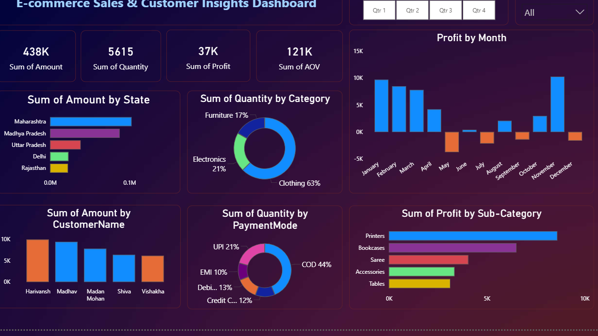

# 📊 E-commerce Sales & Customer Analysis Dashboard

## 🎯 Business Problem
Businesses often struggle to understand sales performance, customer behavior, and product demand. This dashboard aims to solve these challenges by providing actionable insights.

## 📌 Overview

This project focuses on analyzing e-commerce sales data using Power BI. The dashboard provides insights into sales performance, customer behavior, and product trends by combining Orders and Order Details datasets.

It helps businesses make data-driven decisions to improve revenue and customer engagement.

## 🛠️ Tools & Technologies

* Power BI (Data Visualization)
* Microsoft Excel / CSV (Data Source)
* Data Cleaning & Modeling

## 📂 Dataset

* **orders.csv** → Contains order-level information (City, CustomerName, Order Date)
* **details.csv** → Contains product-level details (Category, Quantity, Profit)

## ⚙️ Steps Performed

1. Imported datasets into Power BI
2. Cleaned and transformed data
3. Created relationships between tables
4. Built calculated measures (Sales, Profit, Quantity)
5. Designed interactive dashboard with filters and visuals

## 📊 Key Insights / Results

* Identified top-performing products and categories
* Analyzed monthly and yearly sales trends
* Found high-value customers and repeat buyers
* Compared regional performance
* Evaluated overall profitability

## ▶️ How to Run

1. Download the `.pbix` file
2. Open in Power BI Desktop
3. Load the dataset (if required)
4. Explore the dashboard using filters and visuals

## 📸 Dashboard Preview

## 🚀 Project Outcome

This dashboard helps in understanding sales patterns, improving business strategies, and enhancing customer experience using data analytics.

